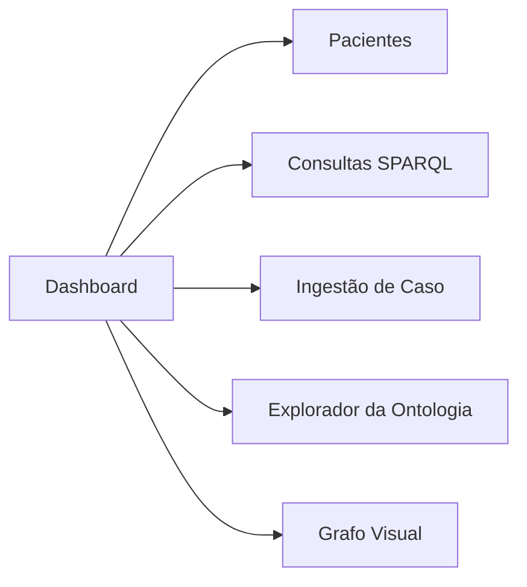

# Plano de Implementação — Frontend ODSDR

Frontend web para o sistema ODSDR (Ontologia para Diagnóstico Semântico de Doenças Respiratórias). O frontend consome a API FastAPI já implementada em `service/semantic_api.py` e oferece uma interface visual completa para **consulta**, **ingestão** e **exploração** do grafo semântico.

## Decisão Tecnológica

| Aspecto | Escolha | Justificativa |
|---|---|---|
| Framework | **HTML + CSS + JS vanilla** | Projeto acadêmico, sem necessidade de build toolchain |
| Estilo | CSS custom com design-system próprio | Visual premium, dark mode, glassmorphism |
| Gráfico de ontologia | **D3.js (CDN)** | Visualização interativa de grafos RDF |
| Ícones | **Lucide Icons (CDN)** | Leves, modernos, MIT |
| Estrutura | SPA com roteamento por hash | Navegação sem reload |
| Servido por | **FastAPI Static Files** | Sem necessidade de servidor extra |

> [!IMPORTANT]
> O frontend será servido pelo próprio FastAPI como static files, eliminando problemas de CORS e simplificando deploy.

---

## Arquitetura de Páginas

O frontend será uma **Single-Page Application** com 6 seções navegáveis:



### 1. Dashboard (`#/`)
- **Health check** da API com indicador visual (verde/vermelho)
- **Cards de métricas**: total de pacientes, doenças, sintomas, exames, consultas disponíveis
- **Versão da ontologia** (via `GET /ontology/summary`)
- Mini-resumo de classes e propriedades

### 2. Pacientes (`#/pacientes`)
- **Tabela interativa** com todos os pacientes (via `GET /patients`)
- Colunas: ID, Idade, Sexo, Fumante, Sintomas, Doença, Exame, Tratamento, Profissional
- **Filtros**: por doença, por faixa etária, por fumante
- **Detalhes expandíveis** ao clicar em um paciente
- Tags coloridas para sintomas e fatores de risco

### 3. Consultas SPARQL (`#/consultas`)
- **Lista de queries** disponíveis (via `GET /queries`)
- Seleção de query com descrição da pergunta de competência
- **Botão de execução** que chama `GET /queries/{name}?format=json`
- **Resultado exibido em tabela** formatada
- **Alternância** entre visualização tabela e JSON raw

### 4. Ingestão de Caso Clínico (`#/ingestao`)
- **Formulário completo** para `POST /cases`
- Campos: patient_id, diagnostico_id, idade, sexo, fumante, sintomas, exame, doença, tratamento, profissional, data
- **Selects dinâmicos** populados via `GET /entities/{class}` para: sintomas, exames, doenças, tratamentos, profissionais
- **Validação client-side** antes do envio
- **Feedback visual** de sucesso/erro após ingestão
- Botão de preenchimento rápido para testes

### 5. Explorador da Ontologia (`#/ontologia`)
- **Sumário da ontologia** (via `GET /ontology/summary`)
- **Listas navegáveis** de: Classes, Propriedades Objetais, Propriedades de Dados, Indivíduos
- Contadores por categoria
- **Explorador de entidades** por classe (via `GET /entities/{class}`)

### 6. Grafo Visual (`#/grafo`)
- **Visualização interativa** do grafo RDF com D3.js force-directed
- Dados obtidos via `GET /export?format=json-ld`
- Nós coloridos por tipo (Doença, Paciente, Sintoma, etc.)
- **Zoom, pan e drag** de nós
- **Filtro por tipo de entidade** para simplificar visualização
- Legenda interativa

---

## Mapeamento Frontend → API

| Página | Endpoint(s) consumidos |
|---|---|
| Dashboard | `GET /health`, `GET /ontology/summary`, `GET /patients` |
| Pacientes | `GET /patients` |
| Consultas | `GET /queries`, `GET /queries/{name}` |
| Ingestão | `POST /cases`, `GET /entities/{class}` |
| Ontologia | `GET /ontology/summary`, `GET /entities/{class}` |
| Grafo | `GET /export?format=json-ld` |

---

## Estrutura de Arquivos

```text
frontend/                     [NEW]
├── index.html                # SPA principal
├── css/
│   └── style.css             # Design system completo
├── js/
│   ├── app.js                # Router e inicialização
│   ├── api.js                # Client HTTP para a API
│   ├── pages/
│   │   ├── dashboard.js      # Página Dashboard
│   │   ├── patients.js       # Página Pacientes
│   │   ├── queries.js        # Página Consultas SPARQL
│   │   ├── ingest.js         # Página Ingestão
│   │   ├── ontology.js       # Página Explorador
│   │   └── graph.js          # Página Grafo Visual
│   └── components/
│       ├── navbar.js         # Barra de navegação
│       ├── table.js          # Componente de tabela reutilizável
│       ├── card.js           # Componente de card de métricas
│       └── toast.js          # Notificações toast
└── assets/
    └── favicon.svg           # Ícone do projeto
```

---

## Proposed Changes

### Componente: Frontend (NOVO)

#### [NEW] [index.html](file:///mnt/c/Users/danie/Desktop/Websem-ntica/frontend/index.html)
- HTML principal da SPA
- Carrega CSS, CDNs (D3.js, Lucide), e módulos JS
- Container `<main id="app">` para conteúdo dinâmico
- Navbar lateral fixa

#### [NEW] [style.css](file:///mnt/c/Users/danie/Desktop/Websem-ntica/frontend/css/style.css)
- Design system completo: variáveis CSS, dark mode, tipografia (Inter/Google Fonts)
- Glassmorphism nos cards, gradientes suaves
- Responsividade mobile-first
- Animações e transições micro-interativas
- Estilos para tabelas, formulários, navbar, toasts, grafo

#### [NEW] [app.js](file:///mnt/c/Users/danie/Desktop/Websem-ntica/frontend/js/app.js)
- Router SPA baseado em `hashchange`
- Mapeamento de rotas para módulos de página
- Inicialização da navbar e event listeners

#### [NEW] [api.js](file:///mnt/c/Users/danie/Desktop/Websem-ntica/frontend/js/api.js)
- Classe `API` com métodos para cada endpoint
- Base URL configurável (`/api/` por padrão)
- Tratamento de erros HTTP unificado

#### [NEW] Páginas JS (`pages/*.js`)
- Cada arquivo renderiza uma seção completa
- Funções `render()` que retornam HTML ou manipulam DOM
- Event binding para interações

#### [NEW] Componentes JS (`components/*.js`)
- Componentes reutilizáveis (tabela, card, toast, navbar)

---

### Componente: Backend (alterações mínimas)

#### [MODIFY] [semantic_api.py](file:///mnt/c/Users/danie/Desktop/Websem-ntica/service/semantic_api.py)
- Adicionar montagem de `StaticFiles` para servir o diretório `frontend/`
- Redirecionar rota `/` para `frontend/index.html`
- Prefixar todas as rotas de API com `/api/` para evitar conflito

#### [MODIFY] [requirements.txt](file:///mnt/c/Users/danie/Desktop/Websem-ntica/requirements.txt)
- Adicionar `aiofiles` (necessário para StaticFiles async do FastAPI)

#### [MODIFY] [test_api_service.py](file:///mnt/c/Users/danie/Desktop/Websem-ntica/scripts/test_api_service.py)
- Ajustar imports caso os endpoints mudem de rota (provavelmente não necessário pois o smoke test chama as funções diretamente)

---

## Design Visual

### Paleta de Cores (Dark Mode)
| Token | Valor | Uso |
|---|---|---|
| `--bg-primary` | `#0f1117` | Fundo principal |
| `--bg-card` | `rgba(255,255,255,0.04)` | Cards glass |
| `--accent` | `#6366f1` | Indigo — ações primárias |
| `--accent-hover` | `#818cf8` | Hover indigo |
| `--success` | `#22c55e` | Status OK, sucesso |
| `--danger` | `#ef4444` | Erro, alerta |
| `--warning` | `#f59e0b` | Aviso |
| `--text-primary` | `#f1f5f9` | Texto principal |
| `--text-secondary` | `#94a3b8` | Texto secundário |
| `--border` | `rgba(255,255,255,0.08)` | Bordas sutis |

### Tipografia
- **Heading**: `'Inter', sans-serif` — weight 600/700
- **Body**: `'Inter', sans-serif` — weight 400
- Import via Google Fonts CDN

### Elementos Visuais
- Cards com `backdrop-filter: blur(16px)` e borda translúcida
- Gradiente sutil no header/sidebar
- Micro-animações em hover (scale, glow)
- Transições de página com fade-in
- Tabelas com highlight de linha ao hover
- Tags/badges coloridos por tipo de entidade

---

## User Review Required

> [!IMPORTANT]
> **Prefixação de rotas da API**: As rotas atuais da API (`/health`, `/queries`, etc.) serão mantidas, mas também estarão acessíveis via `/api/health`, `/api/queries`, etc. O frontend usará o prefixo `/api/`. O smoke test existente continuará funcionando sem alteração pois chama as funções Python diretamente.

> [!WARNING]
> **D3.js via CDN**: O grafo visual depende de D3.js carregado via CDN. Se o ambiente não tiver acesso à internet durante uso, esta funcionalidade não estará disponível. Uma alternativa seria incluir o arquivo `.min.js` localmente.

---

## Verification Plan

### Testes Automatizados
1. **Smoke test existente** (deve continuar passando):
   ```bash
   .venv/bin/python scripts/test_api_service.py
   ```
   O smoke test chama funções diretamente, não passa por HTTP, portanto a adição de static files e prefixo `/api/` não deve afetar.

2. **Teste de servir static files**:
   ```bash
   # Com a API rodando:
   .venv/bin/uvicorn service.semantic_api:app --host 127.0.0.1 --port 8000
   # Em outro terminal:
   curl -s -o /dev/null -w "%{http_code}" http://127.0.0.1:8000/
   # Esperado: 200
   curl -s -o /dev/null -w "%{http_code}" http://127.0.0.1:8000/api/health
   # Esperado: 200
   ```

### Testes via Browser
Após subir a API, abrir `http://127.0.0.1:8000/` no browser e verificar:

1. **Dashboard**: cards de métricas carregam, health check mostra "OK" em verde
2. **Pacientes**: tabela carrega com ≥10 pacientes, filtros funcionam
3. **Consultas**: lista 10 queries, executar uma retorna tabela com dados
4. **Ingestão**: selects populam dinamicamente, enviar caso retorna sucesso
5. **Ontologia**: sumário exibe versão, contadores de classes/propriedades corretos
6. **Grafo**: visualização D3 renderiza nós e arestas, zoom funciona

> [!NOTE]
> Os testes via browser serão executados com o `browser_subagent` durante a fase de verificação para validação visual automatizada.
